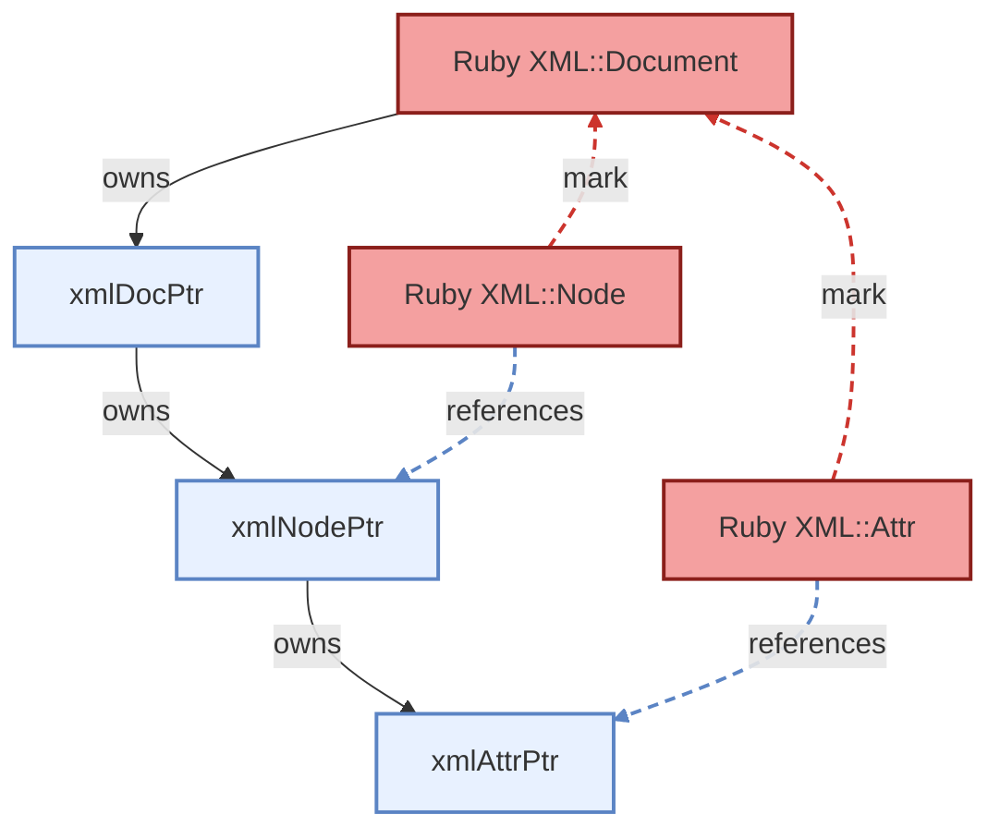

# Memory Management

libxml-ruby automatically manages memory for the underlying libxml2 C library. This page explains the ownership model and how the bindings keep Ruby objects and libxml2 C structures in sync.

## Ownership Model

libxml2 has a simple ownership rule: an `xmlDocPtr` owns the tree attached to it, and `xmlFreeDoc` frees the document and the entire attached tree. When code unlinks a node with `xmlUnlinkNode`, that detached subtree is no longer document-owned and must either be reattached or freed with `xmlFreeNode`.

libxml-ruby sits on top of that model. In the normal case, the document is the owner. Ruby node and attr objects do not own the libxml node or attr they point at. They are references into libxml-owned memory, and their mark functions keep the owning Ruby document alive while Ruby still has live references into the tree.

In the diagram below:

- solid lines mean `owns`
- blue dashed lines mean `references` a libxml C object
- red dashed lines mean `mark`, which is a Ruby-to-Ruby GC reference



The solid ownership chain is the important part. `XML::Document` owns the `xmlDocPtr`. The `xmlDocPtr` owns the tree, and the `xmlNodePtr` owns its attrs. The dashed lines are references, not ownership. The blue dashed edges mean Ruby objects reference libxml objects. The red dashed `mark` edges mean a live Ruby node or attr keeps the Ruby document alive during GC so the underlying tree is not freed while Ruby still references it.

## Detached Root Nodes

[Detached nodes](../xml/nodes.md#detached-nodes) are the one exception to the document-owns-everything model. A newly created node is Ruby-owned until it is inserted into a document tree. Removing a node transfers ownership back to Ruby.

Internally, this is managed by `rxml_node_manage` (Ruby takes ownership), `rxml_node_unmanage` (libxml takes ownership), and `rxml_node_free` (frees a detached node on GC).

## Object Identity

Because temporary wrappers are created on demand, accessing the same node twice may return different Ruby objects:

```ruby
child1 = node.children[0]
child2 = node.children[0]

child1 == child2     # => true  (same underlying node)
child1.equal?(child2) # => false (different Ruby objects)
```

Use `==` or `eql?` to compare nodes, not `equal?`.

Documents and detached root nodes do maintain identity through the [registry](registry.md) — retrieving the same document or detached root always returns the same Ruby object.

## Preventing Premature Collection

Keep a reference to the document (or a managed root node) as long as you use any of its nodes:

```ruby
# Safe - doc stays in scope
doc = XML::Parser.file('data.xml').parse
nodes = doc.find('//item')
nodes.each { |n| process(n) }

# Risky - doc may be collected
nodes = XML::Parser.file('data.xml').parse.find('//item')
GC.start  # doc could be freed here
nodes.first.name  # potential crash
```

## GC Sweep Order

During garbage collection (or at program exit), Ruby does not guarantee the order in which objects are freed. The document object is almost always freed before any child node wrappers. This is safe because child node wrappers are non-owning — they have no free function. The document's free function calls `xmlFreeDoc`, which recursively frees the entire tree. The child wrappers simply become stale and are collected without action.
