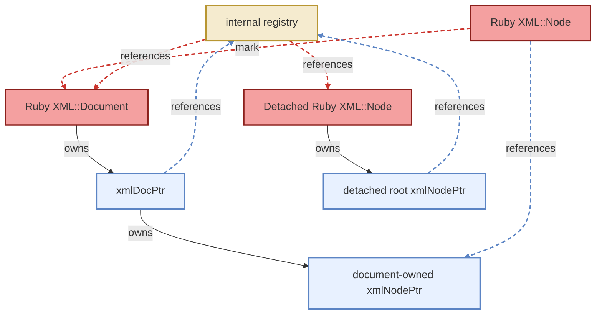

# Pointer Registry

The bindings need to map libxml2 C pointers back to their Ruby wrapper objects. This is used for two purposes:

1. **Object identity** - returning the same Ruby object when the same C pointer is encountered again (documents and detached root nodes)
2. **GC reachability** - mark functions look up the owning Ruby document to keep it alive while Ruby references exist into the tree

## Design

The registry is a pointer-keyed `st_table` in `ruby_xml_registry.c` with three operations:

```c
void  rxml_registry_register(void *ptr, VALUE obj);
void  rxml_registry_unregister(void *ptr);
VALUE rxml_registry_lookup(void *ptr);   /* Qnil on miss */
```

The registry is **not** a GC root. It does not keep objects alive. Objects stay alive through the normal mark chains — mark functions look up the registry instead of holding direct references.

## What Gets Registered

Only objects that own their underlying C structure are registered:

| C pointer | Ruby wrapper | Registered when |
|-----------|-------------|-----------------|
| `xmlDocPtr` | `XML::Document` | Document is created or parsed |
| detached root `xmlNodePtr` | `XML::Node` | Node is created or detached via `remove!` |

Document-owned child nodes are **not** registered. They are lightweight, non-owning wrappers that get fresh Ruby objects each time they are accessed.

## How Mark Functions Use It

When Ruby's GC runs the mark phase, node and attr mark functions look up the owning document through the registry:



For an attached node, the mark function reads `xnode->doc` (maintained by libxml2), looks up the document in the registry, and marks the Ruby document object. For a detached subtree, it walks to the root via parent pointers, looks up the root in the registry, and marks it.

## Lifecycle

Registered pointers must be unregistered before the underlying C structure is freed:

- `rxml_document_free` unregisters the `xmlDocPtr` before calling `xmlFreeDoc`
- `rxml_node_free` unregisters the detached root before calling `xmlFreeNode`
- `rxml_node_unmanage` unregisters when a detached node is attached to a document (libxml takes ownership)
